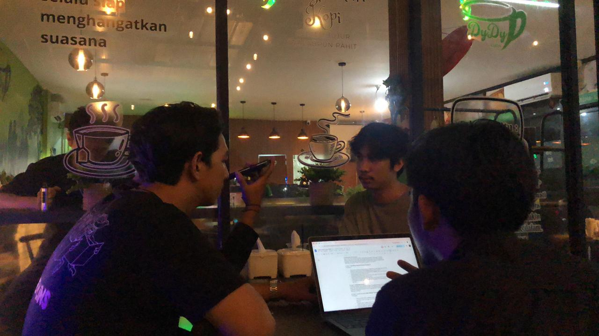
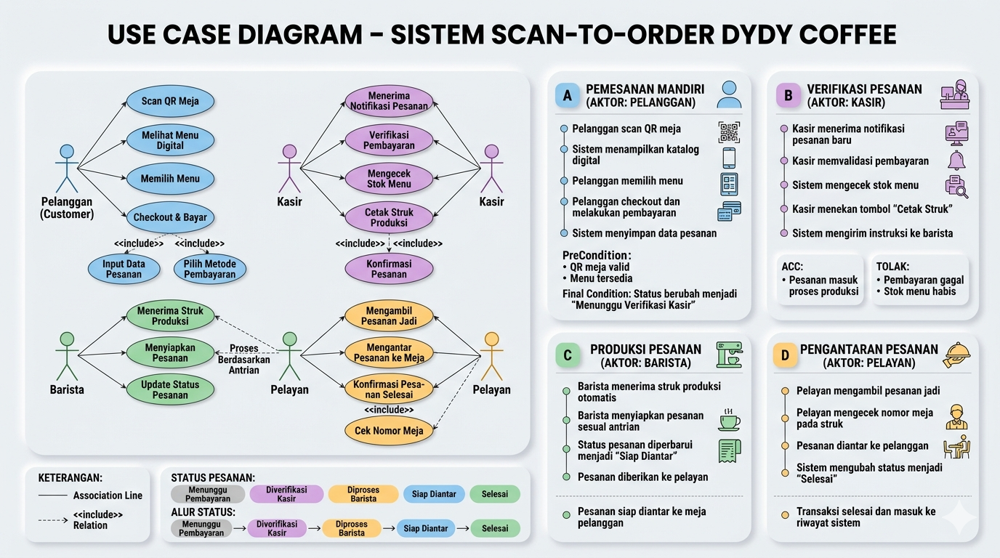

# DYDY Coffee Scan-to-Order System

## Tentang Proyek

Proyek ini dibuat berdasarkan hasil observasi dan wawancara yang dilakukan di DYDY Coffee. Saat ini proses pemesanan masih dilakukan melalui kasir menggunakan tablet yang tersedia di area kasir.

Pada kondisi tertentu, terutama saat akhir pekan atau jam ramai, pelanggan harus menunggu antrean sebelum dapat melakukan pemesanan. Selain itu, pelanggan juga memiliki waktu yang relatif terbatas untuk melihat menu karena ada pelanggan lain yang sedang menunggu giliran.

Untuk membantu mengatasi kondisi tersebut, dibuat rancangan sistem Scan-to-Order berbasis web yang memungkinkan pelanggan memesan langsung dari meja melalui QR Code.

---

## Dokumentasi Wawancara

<p align="center">
    
</p>

<p align="center">
    <i>Gambar 1. Wawancara dengan Bapak Dani selaku Owner DYDY Coffee</i>
</p>

---

## Hasil Wawancara

Berdasarkan wawancara yang dilakukan dengan Bapak Dani selaku owner DYDY Coffee, diketahui bahwa proses pemesanan saat ini masih berjalan secara manual melalui kasir. Menurut beliau, antrean biasanya terjadi ketika jumlah pelanggan meningkat, terutama pada akhir pekan.

Beliau juga menyampaikan bahwa penerapan sistem pemesanan digital dapat membantu pelanggan karena mereka dapat memilih menu dengan lebih santai tanpa harus mengantre terlebih dahulu.

Selain itu, tantangan yang perlu diperhatikan apabila sistem diterapkan adalah kestabilan jaringan internet serta konsistensi staf dalam memperbarui informasi stok menu.

---

## Permasalahan yang Ditemukan

Beberapa permasalahan yang ditemukan selama proses analisis antara lain:

* Pemesanan masih terpusat di area kasir.
* Antrean dapat terjadi ketika jumlah pelanggan meningkat.
* Kasir harus menangani proses pemesanan dan pembayaran secara bersamaan.
* Pelanggan terkadang harus menunggu sebelum dapat melakukan pemesanan.

---

## Solusi yang Diusulkan

Solusi yang ditawarkan adalah sistem pemesanan berbasis web yang dapat diakses melalui QR Code pada setiap meja.

Dengan sistem ini, pelanggan dapat melihat menu, memilih pesanan, dan melakukan checkout langsung dari perangkat masing-masing. Data pesanan yang masuk akan ditampilkan pada dashboard sehingga kasir dan barista dapat memantau pesanan dengan lebih mudah.

---

## Analisis Sistem

| Sistem Saat Ini                             | Sistem Usulan                            |
| ------------------------------------------- | ---------------------------------------- |
| Pemesanan dilakukan melalui kasir           | Pemesanan dilakukan melalui QR Code      |
| Kasir mencatat pesanan secara manual        | Pesanan dicatat langsung oleh sistem     |
| Antrean sering terjadi saat ramai           | Pelanggan dapat memesan dari meja        |
| Informasi pesanan disampaikan secara manual | Informasi pesanan tersimpan dalam sistem |

---

## Aktor Sistem

### Pelanggan

Pelanggan dapat mengakses sistem melalui QR Code yang tersedia pada meja. Setelah masuk ke halaman menu, pelanggan dapat memilih menu, melakukan checkout, dan melakukan konfirmasi pembayaran.

### Kasir

Kasir bertugas memeriksa pesanan yang masuk, melakukan verifikasi pembayaran, serta memperbarui status pesanan sesuai kondisi sebenarnya.

### Barista

Barista menerima informasi pesanan yang sudah diverifikasi oleh kasir dan menyiapkan pesanan sesuai data yang terdapat pada sistem.

### Pelayan

Pelayan bertugas mengantarkan pesanan yang sudah selesai dibuat ke meja pelanggan sesuai nomor meja yang tercatat.

---

## Use Case Diagram



<p align="center">
    <i>Gambar 2. Use Case Diagram Sistem Scan-to-Order DYDY Coffee</i>
</p>

---

## Alur Sistem

1. Pelanggan memindai QR Code yang tersedia di meja.
2. Sistem menampilkan daftar menu yang tersedia.
3. Pelanggan memilih menu yang ingin dipesan.
4. Pelanggan melakukan checkout.
5. Sistem menampilkan rincian pembayaran.
6. Pelanggan melakukan konfirmasi pembayaran.
7. Kasir melakukan verifikasi.
8. Barista menyiapkan pesanan.
9. Pelayan mengantarkan pesanan ke meja pelanggan.

---

## Teknologi yang Digunakan

* Laravel
* PHP
* MySQL
* HTML
* CSS
* JavaScript

---

## Tim Pengembang

| Nama                      | NPM        |
| ------------------------- | ---------- |
| Bryan Ananda Saputra Hulu | 4524210020 |
| Muhammad Agis Irawan      | 4524210056 |
| M. Al Ghifari             | 4524210052 |
| Bayu Sardo Situmorang     | 4524210019 |
| Dzikrullah Surachman      | 4524210029 |

---

## Git Workflow

```bash
git clone <repository>

git checkout -b nama_branch

git add .
git commit -m "pesan commit"

git push -u origin nama_branch

git pull origin main
```

---

## Kesimpulan

Berdasarkan hasil wawancara dan analisis yang telah dilakukan, sistem Scan-to-Order dapat digunakan sebagai alternatif untuk membantu proses pemesanan di DYDY Coffee. Dengan adanya QR Code pada setiap meja, pelanggan tidak perlu datang ke kasir untuk melakukan pemesanan sehingga proses pelayanan dapat berjalan dengan lebih praktis dan teratur.
